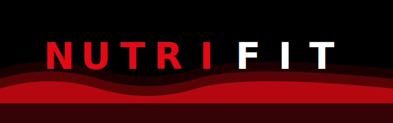

<div align="center">
  
  <br/>


### *A Premium Full-Stack Fitness & Nutrition Tracker*

[](https://git.io/typing-svg)

<br/>

[](https://react.dev/)
[](https://dotnet.microsoft.com/)
[](https://mysql.com/)
[](https://vercel.com/)
[](https://render.com/)
[![Aiven](https://img.shields.io/badge/Database-Aiven-FF4F00?style=for-the-badge&logo=data:image/svg%2Bxml;base64,PHN2ZyB4bWxucz0iaHR0cDovL3d3dy53My5vcmcvMjAwMC9zdmciIHZpZXdCb3g9IjAgMCAxODAgMTUwIj48ZyBmaWxsPSIjRkZGRkZGIiBmaWxsLXJ1bGU9ImV2ZW5vZGQiPjxwYXRoIGQ9Ik0xMzkuMSA5OS45YzMuMSAwIDYuMi42IDkgMS42IDQuNS01LjIgNi45LTEwLjggNi45LTE2LjcgMC05LjYtNi41LTE4LjgtMTguMi0yNkMxMjQuMiA1MS4yIDEwNy4zIDQ3IDg5LjQgNDdjLTE4IDAtMzQuOCA0LjItNDcuNCAxMS45LTExLjggNy4yLTE4LjIgMTYuNC0xOC4yIDI2IDAgNS44IDIuNCAxMS41IDYuOSAxNi43IDIuOS0xIDUuOS0xLjYgOS0xLjYgNy4xIDAgMTMuNyAyLjcgMTguNyA3LjggMy41IDMuNSA1LjggNy44IDcgMTIuNCA3LjYgMS44IDE1LjcgMi43IDI0IDIuNyBzMTYuNS0xIDI0LTIuN2MxLjEtNC43IDMuNS05IDctMTIuNCA1LTUuMSAxMS42LTcuOSAxOC43LTcuOXptLTQ5LjctMjJjLTguMSAwLTE0LjctNi42LTE0LjctMTQuN2gyOS40YzAgOC4xLTYuNiAxNC43LTE0LjcgMTQuN3oiLz48cGF0aCBkPSJNMzguMyA1MmMxLjQtLjkgMi45LTEuNyA0LjQtMi40aC0uMWMtMy43LTIuOC04LjEtNC4xLTEyLjQtNC4xLTYuMyAwLTEyLjUgMi44LTE2LjYgOC4zTDEyIDU1LjlsMTEuNyA4LjhjMy42LTQuNyA4LjUtOSAxNC42LTEyLjd6Ii8+PHBhdGggZD0ibTE1NSA2NC43IDExLjctOC44LTEuNy0yLjNjLTQuMS01LjQtMTAuMy04LjMtMTYuNi04LjMtNC4zIDAtOC43IDEuNC0xMi40IDQuMWgtLjFjMS41LjggMyAxLjYgNC40IDIuNCA2LjIgMy45IDExLjEgOC4yIDE0LjcgMTIuOXoiLz48cGF0aCBkPSJNMjMuOCAxMDUuMmMtMy45LTUtNi40LTEwLjUtNy4xLTE2LjMtLjItMS4zLS4zLTIuNy0uMy00IDAtNi43IDIuMi0xMy4yIDYuNS0xOWgtMS41QzEwIDY1LjkuNyA3NS4yLjcgODYuNnYyLjloMTUuNGMtNCAzLjMtNi42IDgtNy4zIDEzLjItLjcgNS41LjcgMTAuOSA0LjEgMTUuM2wxLjMgMS43YzEuMi00LjUgMy41LTguNiA2LjktMTIuNy0uOSAxLjctMS43IDIuNy0yLjV6Ii8+PHBhdGggZD0iTTE3OC4xIDg2LjVjMC0xMS40LTkuMy0yMC43LTIwLjctMjAuN2gtMS41YzQuMiA1LjkgNi41IDEyLjMgNi41IDE5IDAgMS40LS4xIDIuNy0uMyA0LS44IDUuNy0zLjIgMTEuMi03LjEgMTYuMyAxIC44IDIgMS42IDIuOSAyLjUgMy40IDMuNCA1LjcgNy41IDYuOSAxMmwxLjMtMS43YzMuNC00LjQgNC44LTkuOCA0LjEtMTUuMy0uNy01LjItMy4zLTkuOC03LjMtMTMuMmgxNS40di0yLjl6Ii8+PHBhdGggZD0iTTY0LjQgNDIuMmMxMS40IDAgMjAuNy05LjMgMjAuNy0yMC43Qzg1LjEgMTAuMSA3NS44LjggNjQuNC44IDUzIC44IDQzLjcgMTAuMSA0My43IDIxLjVjMCAxMS40IDkuMyAyMC43IDIwLjcgMjAuN3ptMC0zMmMuMSAwIC4xIDAgMCAwLTEuNCAxLjUtMi4zIDMuNS0yLjMgNS43IDAgNC40IDMuNiA4IDggOCA0LjIgMCA0LjItLjkgNS43LTIuNHYuMWMwIDYuMy01LjEgMTEuNC0xMS40IDExLjQtNi4zIDAtMTEuNC01LjEtMTEuNC0xMS40LjEtNi40IDUuMi0xMS40IDExLjQtMTEuNHoiLz48cGF0aCBkPSJNMTE0LjMgNDIuMmMxMS40IDAgMjAuNy05LjMgMjAuNy0yMC43QzEzNSAxMC4xIDEyNS43LjggMTE0LjMuOGMtMTEuNCAwLTIwLjcgOS4zLTIwLjctMjAuNyAwIDExLjUgOS4yIDIwLjcgMjAuNyAyMC43em0wLTMyYy0xLjQgMS41LTIuMyAzLjUtMi4zIDUuNyAwIDQuNCAzLjYgOCA4IDggMi4yIDAgNC4yLS45IDUuNy0yLjR2LjFjMCA2LjMtNS4xIDExLjQtMTEuNCAxMS40LTYuMyAwLTExLjQtNS4xLTExLjQtMTEuNCAwLTYuNCA1LjEtMTEuNCAxMS40LTExLjR6Ii8+PHBhdGggZD0iTTM5LjYgMTA1LjdjLTExLjQgMC0yMC43IDkuMy0yMC43IDIwLjcgMCAxMS40IDkuMyAyMC43IDIwLjcgMjAuNyAyLjQgMCA0LjctLjQgNi44LTEuMmwtLjYtLjZjLTYtNi04LTEzLjctNC41LTE3LjJzMTEuMi0xLjUgMTcuMiA0LjVsLjYuNmMuOC0yLjEgMS4yLTQuNCAxLjItNi44IDAtMTEuNC05LjItMjAuNy0yMC43LTIwLjd6Ii8+PHBhdGggZD0iTTEzOS4xIDEwNS43Yy0xMS40IDAtMjAuNyA5LjMtMjAuNyAyMC43IDAgMi40LjQgNC43IDEuMiA2LjhsLjYuNmM2LTYgMTMuNy04IDE3LjItNC41czEuNSAxMS4yLTQuNSAxNy4ybC0uNi42YzIuMS44IDQuNCAxLjIgNi44IDEuMiAxMS40IDAgMjAuNy05LjMgMjAuNy0yMC43IDAtMTEuNC05LjMtMjAuNy0yMC43LTIwLjd6Ii8+PC9nPjwvc3ZnPg==&logoColor=white)](https://aiven.io/)

<br/>

> 🔥 **NutriFit** is a full-stack fitness and nutrition web application with a premium **Netflix-inspired dark UI**.
> Track your workouts, meals, BMI, goals, and body progress — all from a beautiful cinematic dashboard.

### 🎭 Cinematic Dashboard Experience
*   🌙 **Netflix Dark Mode:** Deep charcoal & vibrant red accents.
*   💎 **Glassmorphism:** Elegant frosted glass components.
*   ⚡ **Real-time Analytics:** Track gains as they happen.
*   📱 **Fully Responsive:** Stunning on any screen size.


<br/>

[](https://nutrifit-topaz.vercel.app/)
[](https://github.com/hrushi-17/NutriFit/issues)
[](https://github.com/hrushi-17/NutriFit/issues)

</div>

<br/>

---

## 📸 Preview

> Netflix-inspired dark cinematic UI with dynamic glassmorphism, red accent glows, and real-time analytics.

| 📊 User Dashboard | 🛡️ Admin Panel | 🎯 Goal Tracker |
|:-----------------:|:--------------:|:---------------:|
| BMI Report, Workout & Diet Cards | User Profile, Progress Graph | Dynamic Status Badges |

<br/>

---

## ✨ Features

<details open>
<summary><b>👤 User Side</b></summary>
<br/>

| Feature | Description |
|---------|-------------|
| 🔐 **JWT Authentication** | Secure login, registration, forgot/reset password |
| 📊 **Personal Dashboard** | BMI, Workouts, Diet, Goals, Progress all in one view |
| 🏋️ **Workout Planner** | Personalized routines with intensity color-coding |
| 🥗 **Diet Planner** | Personalized meal plans by type (Breakfast, Lunch, Dinner, Snack) |
| 🎯 **Goal Tracker** | Set, track and dynamically complete Weight Loss / Muscle Gain goals |
| 📈 **Progress Graph** | Real-time weight + BMI chart with Chart.js |
| 🩺 **BMI Report** | Animated BMI circle with dynamic health tier coloring |
| 💪 **Health Conditions** | Track and manage personal health conditions |

</details>

<details>
<summary><b>🛡️ Admin Side</b></summary>
<br/>

| Feature | Description |
|---------|-------------|
| 👥 **User Management** | Browse all registered users |
| 📋 **Full User Profile** | Age, height, weight, BMI health stats |
| 📉 **Progress Analytics** | Per-user Weight & BMI chart |
| 🎯 **Goal & Body Status** | Real-time active target and body status cards |
| 🩺 **Health Conditions** | View user-reported health issues |

</details>

<br/>

---

## 🛠️ Tech Stack

<div align="center">

| 🎨 Layer | ⚙️ Technology |
|:--------:|:-------------:|
| **Frontend** | React 18 · React Router DOM · Bootstrap 5 · Chart.js · jQuery |
| **Backend** | ASP.NET Core 8 Web API (C#) |
| **Database** | MySQL (hosted on Aiven) |
| **Auth** | JWT Bearer Tokens |
| **Recommendations** | Custom rule-based engine for diet & workout plans |
| **Styling** | Vanilla CSS · Glassmorphism · Animations · Netflix Dark Theme |
| **Deployment** | Vercel · Render · Aiven |

</div>

<br/>

---

## 📁 Project Structure

```text
NutriFit/
├── 📂 backend/
│   └── NutriFit.Api/
│       ├── Dockerfile                 # Docker configuration for Render
│       └── NutriFit.Api/
│           ├── 📂 Controllers/        # API Endpoints (Auth, Admin, Profile, etc.)
│           ├── 📂 Data/               # Database Context & Connections
│           ├── 📂 DTOs/               # Data Transfer Objects
│           ├── 📂 Migrations/         # Entity Framework Migration History
│           ├── 📂 Models/             # Database Entities
│           ├── 📂 Services/           # Business Logic & Email Services
│           ├── 📂 Properties/         # Launch Settings
│           ├── MasterSeed_MySQL.sql   # SQL Script for Database Seed
│           ├── Program.cs             # Application Entry Point
│           ├── appsettings.json       # Main Configuration
│           └── NutriFit.Api.csproj    # Project File
│
└── 📂 frontend/
    └── nutrifit-ui/
        ├── 📂 public/
        │   └── 📂 images/             # Branded Logo & Static Assets
        └── 📂 src/
            ├── 📂 api/                # Axios Global Configuration
            ├── 📂 components/         # Reusable UI Components
            ├── 📂 styles/             # Modular CSS for Pages & Components
            └── 📂 pages/              # Cinematic Page View Components
                ├── Home.js            # Landing Page
                ├── Login.js           # Secure Sign-in
                ├── RegisterUser.js    # New User Signup
                ├── RegisterAdmin.js   # Admin Registration
                ├── ForgotPassword.js  # OTP Recovery Flow
                ├── ResetPassword.js   # New Password Setup
                ├── Dashboard.js       # Main User Hub
                ├── BmiPage.js         # Health Tier Reports
                ├── WorkoutPage.js     # Fitness Recommendations
                ├── DietPage.js        # Nutrition Planning
                ├── GoalPage.js        # Dynamic Progress Tracking
                ├── ProgressPage.js    # Analytics & Charts
                ├── UserHealth.js      # Health Condition Management
                ├── AdminDashboard.js  # Global User Management
                └── AdminHealth.js     # Admin View of User Health
```

<br/>

---

## 🔌 API Endpoints

<details open>
<summary><b>🔐 Auth</b></summary>

| Method | Endpoint | Description |
|:------:|----------|-------------|
| `POST` | `/api/auth/register` | Register new user or admin |
| `POST` | `/api/auth/login` | Login and get JWT token |
| `POST` | `/api/auth/forgot-password` | Send password reset email |
| `POST` | `/api/auth/reset-password` | Reset password with token |

</details>

<details>
<summary><b>👤 Profile</b></summary>

| Method | Endpoint | Description |
|:------:|----------|-------------|
| `GET` | `/api/profile` | Get current user profile |
| `PUT` | `/api/profile/update` | Update user profile |

</details>

<details>
<summary><b>🏋️ Workout & Diet</b></summary>

| Method | Endpoint | Description |
|:------:|----------|-------------|
| `GET` | `/api/workout/my` | Get personalized workout plan |
| `GET` | `/api/diet/my` | Get personalized meal plan |

</details>

<details>
<summary><b>🎯 Goals & Progress</b></summary>

| Method | Endpoint | Description |
|:------:|----------|-------------|
| `POST` | `/api/goals/set` | Set a new fitness goal |
| `GET` | `/api/goals/my` | Get current active goal |
| `DELETE` | `/api/goals/reset` | Reset all goals & progress |
| `POST` | `/api/progress/add` | Log today's weight |
| `GET` | `/api/progress/latest` | Get latest progress entry |
| `GET` | `/api/progress/my` | Get full progress history |

</details>

<details>
<summary><b>🛡️ Admin</b></summary>

| Method | Endpoint | Description |
|:------:|----------|-------------|
| `GET` | `/api/admin/users` | Get all registered users |
| `GET` | `/api/admin/users/{id}` | Get specific user full profile |

</details>

<br/>

---

## 🚀 Deployment Guide

### `Step 1` — 🗄️ Database via Aiven (MySQL)

```
1. Go to aiven.io → New Service
2. Add a MySQL service from the template library
3. Copy the MySQL connection string from the Variables tab
   Format: Server=host;Port=3306;Database=nutrifit;User=root;Password=yourpassword;
```

---

### `Step 2` — ⚙️ Backend via Render

```
1. Go to render.com → New Web Service
2. Connect your GitHub repository
3. Root Directory: backend/NutriFit.Api
4. Runtime: Docker
5. Add Environment Variables:
```

```env
MYSQL_CONNECTION_STRING=Server=host;Port=3306;Database=nutrifit;User=root;Password=yourpassword;
JWT_SECRET=your_super_secret_jwt_key_here
FRONTEND_URL=https://nutrifit-topaz.vercel.app/
```

---

### `Step 3` — 🌐 Frontend via Vercel

```
1. Go to vercel.com → Import GitHub Repo
2. Root Directory: frontend/nutrifit-ui
3. Add Environment Variable:
```

```env
REACT_APP_API_URL=https://your-render-backend.onrender.com/api
```

---

### `Step 4` — 🔧 Update Axios Base URL

In `frontend/nutrifit-ui/src/api/axios.js`:

```js
const api = axios.create({
  baseURL: process.env.REACT_APP_API_URL || "https://your-render-backend.onrender.com/api"
});
```

<br/>

---

## 💻 Local Development

### Prerequisites

```
✅ Node.js 18+
✅ .NET SDK 8.0+
✅ MySQL 8.0+ (local or Aiven)
```

### Backend

```bash
cd backend/NutriFit.Api/NutriFit.Api
dotnet restore
dotnet run
# Runs on https://localhost:7xxx
```

### Frontend

```bash
cd frontend/nutrifit-ui
npm install
npm start
# Runs on http://localhost:3000
```

### `appsettings.Development.json`

```json
{
  "ConnectionStrings": {
    "DefaultConnection": "Server=localhost;Port=3306;Database=nutrifit;User=root;Password=yourpassword;"
  },
  "JwtSettings": {
    "Secret": "your_local_secret_key"
  }
}
```

<br/>

---

## 🎨 Design Highlights

<div align="center">

| 🎬 | Feature | Details |
|:--:|---------|---------|
| 🎨 | **Netflix-Inspired UI** | Dark glassmorphism with cinematic red accents |
| 📊 | **Dynamic Color Badges** | BMI and health categories change color by tier |
| ✅ | **Real-time Goal Status** | Automatically detects when weight goal is achieved |
| 🌀 | **Animated Charts** | Smooth Chart.js line graphs for weight/BMI trends |
| 📱 | **Fully Responsive** | Mobile-first with sliding offcanvas navigation |
| ⚡ | **Micro-animations** | Fade-in, pulse, and glow effects throughout |

</div>

<br/>

---

## 📝 License

This project is open-source and free to use for educational and personal purposes.
Feel free to fork and build on top of it!

<br/>

---

<div align="center">


**Made with ❤️ using React + .NET + MySQL**

⭐ **If you found this helpful, please star this repo!**

</div>
